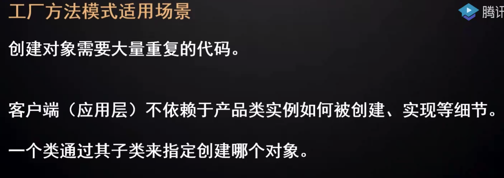
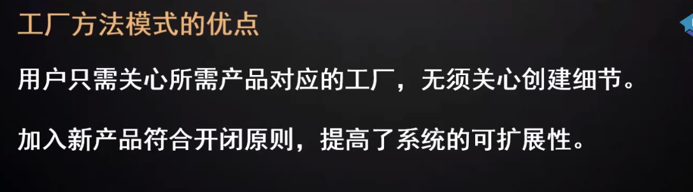
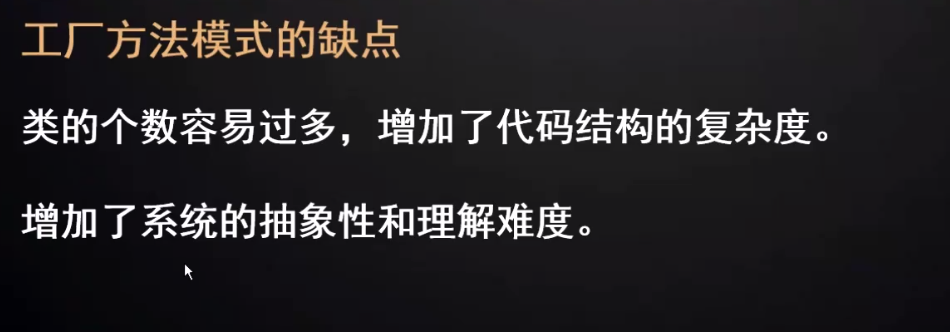
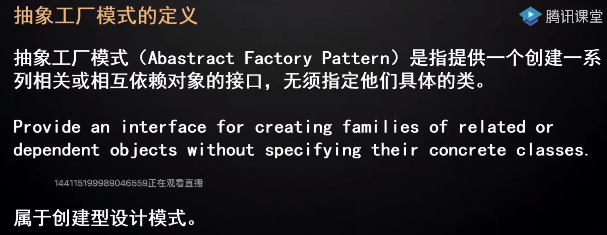
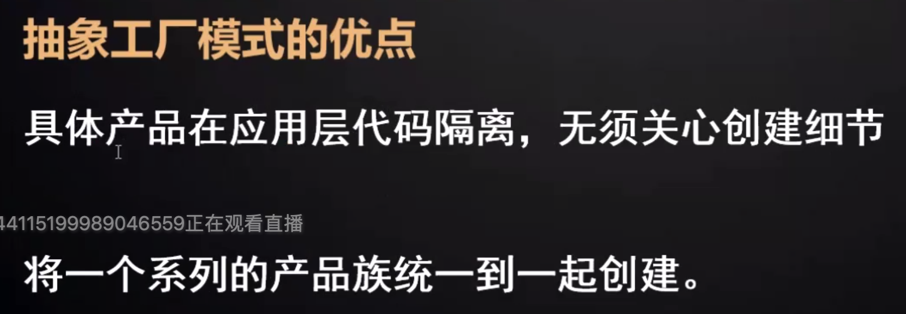
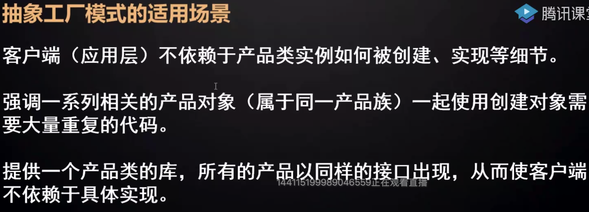
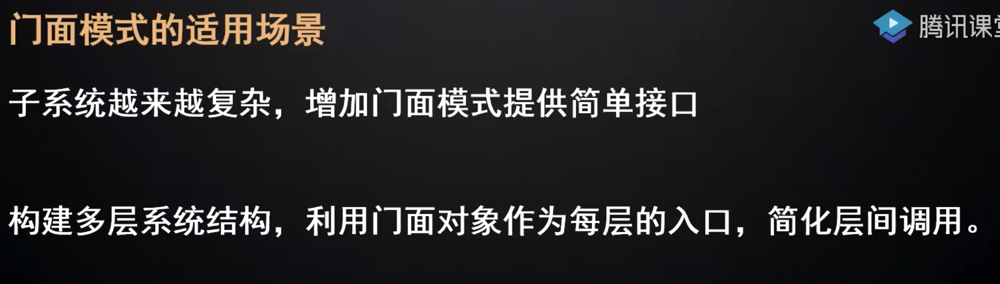

# 设计模式

## 23种设计模式

[23种设计模式](https://gitee.com/code2money/daydayup/tree/master/daydayup-design-patterns)

## 代理模式

# 软件架构设计七大设计原则

## 1、开闭原则

定义：一个软件实体如类、模块和函数应该对拓展开放，对修改关闭。用抽象构建框架，用实现扩展细节

优点：提高软件系统的课复用性及维护性

## 2、依赖倒置原则

定义：高层模块不应该依赖低层模块，二者都应该依赖其抽象

抽象不应该依赖细节；细节应该依赖抽象

针对接口编程，不要针对实现编程

优点：可以减少类间的耦合性、提高系统稳定性，提高代码可读性和可维护性，可降低修改程序所造成的风险

## 3、单一职责原则

定义：不要存在多余一个倒置类变更的原因

一个类、接口、方法只负责一项职责

优点：

- 降低类的复杂度
- 提高类的可读性
- 提高系统的课维护性
- 降低变更引起的风险

​	


## 4、接口隔离原则

## 5、迪米特法则（最少知道原则）

## 6、里氏替换原则

![image-20200222214831809]p(pic/image-20200222214831809.png)

### 7、合成复用原则


## 设计模式

### 工厂模式

#### 简单工厂模式

简单工厂：产品的工厂

用户选择哪个就是哪个

#### 工厂方法模式








工厂方法是工厂的工厂


#### 抽象工厂模式

抽象工厂：复杂产品的工厂









# 单例模式


### 门面模式




# 动态代理

## JDK代理

### 定义

利用Java的反射技术(Java Reflection)，在运行时创建一个实现某些给定接口的新类（也称“动态代理类”）及其实例（对象）,代理的是接口(Interfaces)，不是类(Class)，也不是抽象类。在运行时才知道具体的实现，spring aop就是此原理。

```java
   public static Object newProxyInstance(ClassLoader loader,
                                          Class<?>[] interfaces,
                                          InvocationHandler h)
        throws IllegalArgumentException
```

- loader：用哪个加载器去加载代理对象
- interfaces：动态代理类需要实现的接口
- h：动态代理方法再执行时，会调用h里面的invoke方法执行

### 实现

**要扩展的类**

```java

public class Car implements IVehical {
    public void run() {
        System.out.println("Car会跑");
    }
}
```

**调用处理类InvocationHandler**

```java
public class VehicalInvacationHandler implements InvocationHandler {
 
    private final IVehical vehical;
    public VehicalInvacationHandler(IVehical vehical){
        this.vehical = vehical;
    }
 
    public Object invoke(Object proxy, Method method, Object[] args) throws Throwable {
        System.out.println("---------before-------");
        Object invoke = method.invoke(vehical, args);
        System.out.println("---------after-------");
 
        return invoke;
    }
}
```

- invoke三个参数：
- proxy：就是代理对象，newProxyInstance方法的返回对象
- method：调用的方法
- args: 方法中的参数


**测试**

```java
 public static void main(String[] args) {
  IVehical car = new Car();
 
 IVehical vehical = (IVehical)Proxy.newProxyInstance(car.getClass().getClassLoader(), Car.class.getInterfaces(), new VehicalInvacationHandler(car));
        vehical.run();
}
```

### 原理

​	待补充


## Cglib


# 建造者模式

## 场景

当一个类的构造函数参数个数超过4个，而且这些参数有些是可选的参数，考虑使用构造者模式。

## 实现

```java
public class TestDTO implements Serializable {
    private Long id;
    private String name;
    private Long parentId;
    private String parentName;

    public TestDTO(Builder builder) {
        this.id = builder.id;
        this.name = builder.name;
        this.parentId = builder.parentId;
        this.parentName = builder.parentName;
    }

    public static class Builder {

        private final Long id;//必填

        private final String name; //必填

        private Long parentId;//选填

        private String parentName;//选填

        public Builder(Long id, String name) {
            this.id = id;
            this.name = name;
        }

        public Builder setParentId(Long parentId) {
            this.parentId = parentId;
            return this;
        }

        public Builder setParentName(String parentName) {
            this.parentName = parentName;
            return this;
        }

        public TestDTO build() {
            return new TestDTO(this);
        }
    }
	/*****************省略 set & get ***************/
    @Override
    public String toString() {
        return "TestDTO{" +
                "id=" + id +
                ", name='" + name + '\'' +
                ", parentId=" + parentId +
                ", parentName='" + parentName + '\'' +
                '}';
    }
}
```

**测试**

```java
public static void main(String[] args) {
        TestDTO test = new TestDTO.Builder(123L,"name").build();
        System.out.println(test.toString());
        test = new TestDTO.Builder(12333L,"我叫Tom").setParentId(456L).setParentName("家长名称").build();
        System.out.println(test.toString());
    }
```

**输出**

```java
TestDTO{id=123, name='name', parentId=null, parentName='null'}
TestDTO{id=12333, name='我叫Tom', parentId=456, parentName='家长名称'}
```

**案例**

Lombok的@Builder注解即是实现建造者模式


**拓展**

https://zhuanlan.zhihu.com/p/58093669