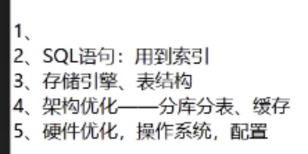

## MySQL

分库分表

- 垂直拆分

​	多库，不同表结构

- 水平拆分

​	相同表结构，多个表

分片算法

- 取模

- 范围

- 日期  如：1个月划分1张表

  

遇到的问题

垂直切分带来问题

- 多数据源问题

- 跨表join问题
  - 全局表 广播表
- 分布式事务问题
  - XA
  - SEATA Fescar Sharding-JDBC支持SEATA
  - Atomikos
  - MQ 最终一致性   本地事务是实时一致性

水平分库分表带来的问题

- 翻页和排序问题
- 全局ID

有一个业务查询非常慢，如何处理？

- SQL语句：用到索引
- 存储引擎、表结构
- 架构优化--分库分表、缓存
- 硬件优化：操作系统、配置

- 