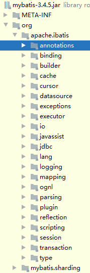

# Mybatis

版本：mybatis 3.4.5

## 目录结构

- annotations：注解
- builder：参数构建
- cache：缓存，一级缓存，二级缓存等
- exceptions：异常处理
- executor：核心，增删改查实现类
- io：读取文件api、封装mybatis自身所需的classLoader
- jdbc：处理sql语句，拼装等
- logging：对Log4j、Log4j2、slf4j 、stdout（控制台）等适配
- mapping：
- plugin：插件
- reflection：反射相关
- session：
- transaction：事务相关
- type：不同数据库类型返回处理
- mybatis.sharding：分库分表处理

## 缓存

PerpetualCache基础类

装饰器模式（不改变原来对象基础上增加其他功能）

<cache/>标签默认使用PerpetualCache

### 一级缓存（local Cache）

作用域：同一个sqlSession，同一个会话相同语句

是放在Executor里面做的缓存PerpetualCache

更新了数据库，一级缓存会清空

##### 分布式情况多个session怎么处理的？

###  二级缓存

作用域：namespace

如果同时开启一级和二级缓存 ：拿缓存顺序 二级>一级

##### 开启方式

- 默认是开启的
- 控制全局二级缓存，默认true

<setting name="cacheEnabled" value="true"> 

- mappe.xml中加入<cache/>
- 排除某个方法不使用二级缓存加属性 userCache="false"

增删改清除缓存原因是属性flushCache默认是true，查询默认是false。如果在查询方法上加入flushCache="true"，查询也是每次都会清除缓存

二级缓存CachingExecutor

二级缓存是和事务绑定的，不执行commit是不会进入到Cache中

一、二级缓存失效条件：增删改后