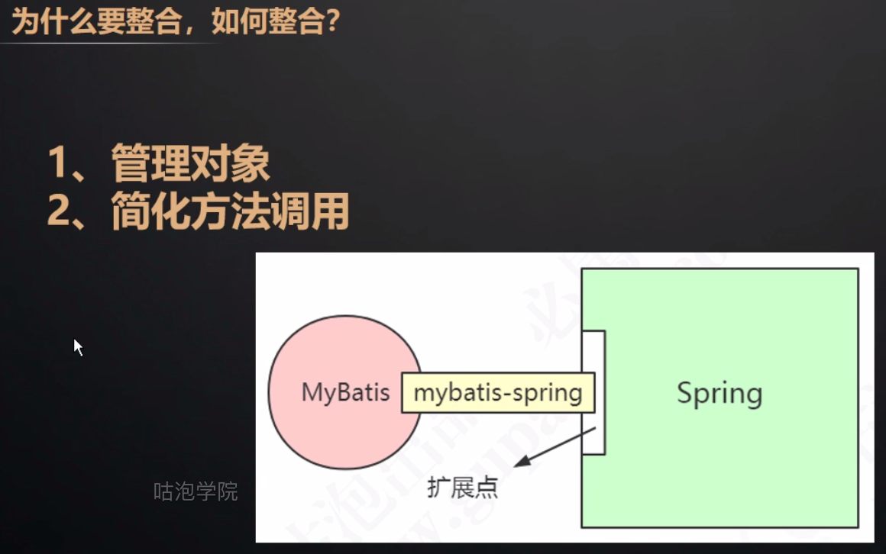

# Mybatis

[官网资料](https://mybatis.org/mybatis-3/zh/index.html)

版本：mybatis 3.4.5

## 目录结构


- annotations：注解
- builder：参数构建
- cache：缓存，一级缓存，二级缓存等
- exceptions：异常处理
- executor：核心，增删改查实现类
- io：读取文件api、封装mybatis自身所需的classLoader
- jdbc：处理sql语句，拼装等
- logging：对Log4j、Log4j2、slf4j 、stdout（控制台）等适配
- mapping：
- plugin：插件
- reflection：反射相关
- session：
- transaction：事务相关
- type：不同数据库类型返回处理
- mybatis.sharding：分库分表处理


## 缓存

PerpetualCache基础类

装饰器模式（不改变原来对象基础上增加其他功能）

<cache/>标签默认使用PerpetualCache

### 一级缓存（local Cache）

作用域：同一个sqlSession，同一个会话相同语句

是放在Executor里面做的缓存PerpetualCache

更新了数据库，一级缓存会清空

##### 分布式情况多个session怎么处理的？

###  二级缓存

作用域：namespace

如果同时开启一级和二级缓存 ：拿缓存顺序 二级>一级

##### 开启方式

- 默认是开启的
- 控制全局二级缓存，默认true

<setting name="cacheEnabled" value="true"> 

- mappe.xml中加入<cache/>
- 排除某个方法不使用二级缓存加属性 userCache="false"

增删改清除缓存原因是属性flushCache默认是true，查询默认是false。如果在查询方法上加入flushCache="true"，查询也是每次都会清除缓存

二级缓存CachingExecutor

二级缓存是和事务绑定的，不执行commit是不会进入到Cache中

一、二级缓存失效条件：增删改后

<<<<<<< HEAD


## 源码阅读

### 工作流程

https://www.processon.com/view/link/5f0020eb1e0853263757abc3

### 源码

XMLConfigBuilder是用来解析全局配置文件Configuration标签

```java
  SqlSessionManager 入口类
  sqlSessionFactory.openSession() 打开会话
  MappedStatement mapper.xml上sql属性
  MapperAnnotationBuilder.parse  解析mapper接口中注解
  MapperProxyFactory 解析后的接口放到这个代理工厂中
    MappeerPorxy
```

默认是创建DefaultSqlSession，它是线程不安全的，每次都需要创建一个新的session

Spring如何保证线程池线程安全

Mybatis动态代理与jdk动态代理的区别是m动态代理没有实现类

### 插件

自定义插件需要实现Interceptor接口

层层拦截需要使用责任链模式

#### 关键对象总结

nterceptor接口：自定义拦截器（实现类）

InterceptorChain：存放插件的容器

Plugin：h对象，提供创建代理类的方法

Invocation：对被代理对象的封装

##### 插件能干啥

- 水平分表
- 权限控制
- 数据加解密，脱敏


### Mybatis和Spring整合

[官网资料](http://mybatis.org/spring/zh/sqlsession.html)

######  为什么要整合Spring？

###### 能带来什么好处？



**扩展点**：

- FactoryBean.getObject() 创建一个Bean
- InitializingBean.afterPropertiesSet() 加载配置后事件
- ApplicationListener.onApplicationEvent() 监听事件

利用Spring的扩展点加入mybatis-spring

入口SqlSessionFactoryBean

FactoryBean 创建Bean，自定义实例化Bean 

afterPropertiesSet()创建


 1、SqlSessionFactory是什么时候创建的？

配置一个标签或加一个Mapper就会有SqlSessionFactory

2、SqlSession怎么获取？

DefaultSqlSession是线程不安全的，所以使用了一个SqlSessionTemplate替代它，通过jdk动态代理每次去创建sqlSession实现线程安全。或者通过继承SqlSessionDaoSupport类实现线程创建和线程安全

即动态代理每次生成一个新的sqlSession对象

3、为什么不getMapper获取代理类？还用MapperProxy吗？

在注册IOC容器时候替换成了代理对象，注入Bean是注入MapperFactoryBean它继承了SqlSessionDaoSupport所以

##### 关键对象

- SqlSessionTemplate（为了解决线程安全问题）

- SqlSessionInterceptor（内部类)

  通过代理方式，在每次调用时创建DefaulateSqlSession

- SqlSessionDaoSupport

  为了获取SqlSessionTemplate

- MapperFactoryBean getObject() getMapper()

​	  为了修改Mapper在Spring里的定义

#### 扩展点

可以想一想通过Spring提供的东西做些什么事情

FactoryBean.getObject()

可以在实例化一个Bean对象时候修改定义，比如替换成另外一个对象并且做一些事情，做一些处理

InitializingBean.afterPropertiesSet()

ApplicationListener.onApplicationEvent()


### 涉及到的设计模式

- 工厂模式

- 建造者模式

- 动态代理
  - MapperProxy
  - ProxyFactory
  - Plugin SqlSessionInterceptor（包含责任链模式）
  - 自带连接池
  - 日志的打印（BaseJdbcLogger/ConnectionLogger/PreparedStatementLogger/ResultSetLogger/StatementLogger）
- 责任链模式

- 装饰器模式
  - CachingExecutor，LRU,FIFO BLOCKING
- 策略模式 
- 适配器模式
  - 日志适配各种第三方组件如 log4j，nologging未直接实现slf4j接口，通过适配器模式调用slf4j接口打印日志

**具体例子待补充**

=======

## 涉及涉及模式

https://blog.csdn.net/star1210644725/article/details/91882685
>>>>>>> 743547efd237988a4e0f15eb3fe75632e3e64dc2
