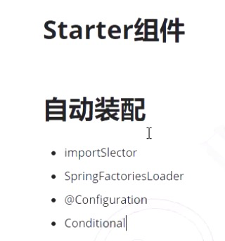
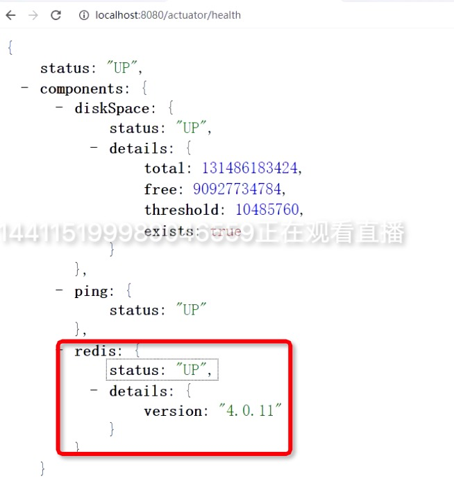
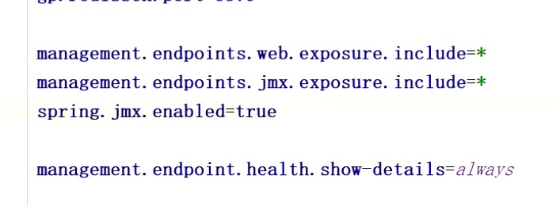

## Spring Boot

# 第一个Starter

自动装配

- importSlector
- SpringFactoriesLoader
- @Configuration
- @Comditional

# Actuator（监控）

- 引用spring-boot-actuator
- 有很多endpoint进行监控，例如beans、into、health、env

## Health状态

health还可以监控其他组件状态，如redis

## metrics

- JVM
- 系统信息（运行时间、平均负载、处理的信息
- 线程池信息
- tomcat会话信息
- Pheuthous/Grafana（图表展示）

## Loggers

- 可以修改日志级别

## info

- Application.properties中可进行设置
  - 可以使用maven中方式
  - info.app.name=@project.name@

## 自定义Endpoint

## Actuator监控形态

- http（web）

- jmx(java Management Extensions)

  - 远程监控/本地监控

  - 线程使用情况

  - 等等

  - 打开方式

    

ApplicationContextAware Spring上下文

EnvironmentAware 环境信息

InitializingBean 初始化bean

DisposableBean 销毁bean

### SpringBoot信息可以发布到Prometheus+Grafana展示