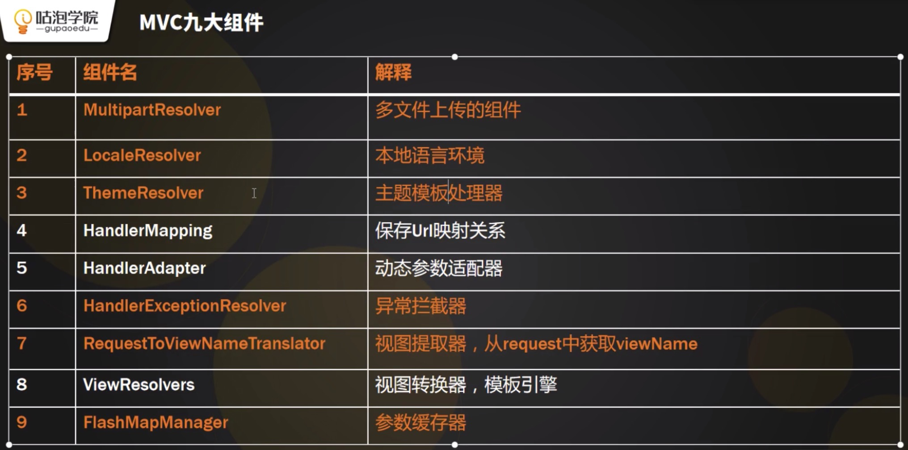

# Spring

> 基于Spring 5.2.2

# Spring核心类

核心Spring IOC、DI、MVC

如何找入口？

依赖注入 静态代理模式

Bean单利模式

## IOC

### ApplicationContext

Bean接口

### BeanWrapper

Bean包装

### BeanDefinition

Bean定义

### BeanDefinitinReader

配置解析器

### MVC有9大组件

#### HandlerMapping

## 问题

### 第一天

1、请用自己的语言描述SpringIOC、DI、MVC的基本执行原理。 

答：Spring IOC、DI、MVC的执行主要分为三个阶段：     

 ①配置阶段：主要完成web.xml和Anntation的配置    

  ②初始化阶段：完成IOC容器初始化、DI自动注入和HandlerMapping的初始化。    

  ③运行阶段：根据用户请求的URL调用对应的Method，将结果打印到浏览器。      

详细过程如下图所示：       

2、Spring中的Bean是线程安全的吗？为什么？ 

https://www.jianshu.com/p/2d7c65641b42

https://blog.csdn.net/qq_29645505/article/details/88432001

答：Spring中的Bean是否线程安全和Spring无关。因为Spring只承担了创建和管理Bean的职责，并没有对Bean进行任何修改。

### 第二天

1、请用自己的语言详细描述Spring IOC和DI的工作流程。 

答：Spring IOC的基本流程:    

①读取配置文件。     

②解析配置文件，并封装成BeanDefinition。    

③把BeanDefinition对应的实例放入到容器进行缓存。      

Spring DI的基本流程：      

①循环读取BeanDefinition的缓存信息。      

②调用getBean()方法创建对象实例。     

③将创建好的对象实例包装为BeanWrapper对象。      

④将BeanWrapper对象缓存到IOC容器。      ⑤循环IOC容器执行以来注入。 

2、BeanDefinition、BeanWrapper、ApplicationContext分别是什么作用？ 

答： 

BeanDefinition 保存每个bean配置的解析结果；        

BeanWrapper 保存原始对象和和原始对象的class；        

ApplicationContext  Spring中最核心的IOC工厂，也是Spring的主入口。        

其中BeanDefinition、BeanWrapper和ApplicationContext三者关系如下图所示：

### 第三天

1、如果不查百度你能默写出Spring MVC九大组件，我都给加分。

# Spring Boot

### 常用注解

- **@RequestParam**：从Request中取值，参数如下
  - defaultValue如果本次请求没有携带这个参数，或者参数为空，那么就启用默认值
  - name绑定本次参数的名称，要跟URL上面的一样
  - required这个参数表明，参数值是不是必须的，true表示必须不能为空，false表示不是必须可以为空
  - value 跟name一样的作用，是name属性的一个别名
- **@PathVariable**：URI中动态参数取值
- **@RequestBody**：主要用来处理Content-Type是application/json，application/xml的Json字符串。多用在Post类型请求中
- **@PageableDefault**：表示spring data提供给我们个性化设置pageable默认配置
- **@RequestMapping**：主要将HTTP请求映射到MVC和REST控制器的处理方法上，用注解在Controller类上
- **@GetMapping**：@RequestMapping(method=RequestMethod.GET)的一个快捷方式
- **@PostMapping**：@RequestMapping(method=RequestMethod.POST)的一个快捷方式
- **@Value**：读取配置文件中属性
- **未完待续...**

# Spring Cloud

# Spring Zuul

# Spring Data

# Spring Gateway

# Spring Pager

# ...

# RestFul风格

​	GET、PUT、POST、DELETE以及PATCH