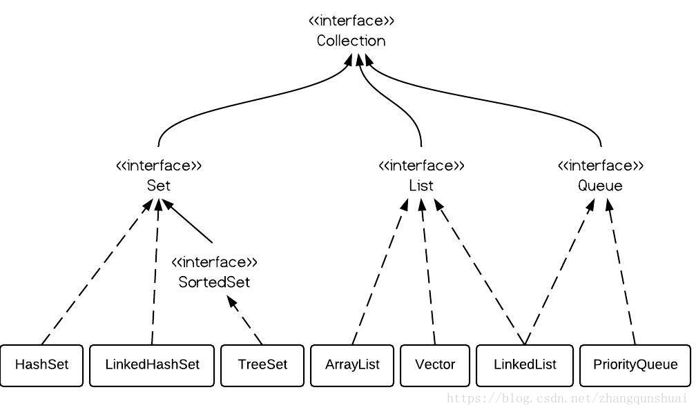

# 资料库

[Java在线API](http://www.matools.com/api/java8)

# Java关键技术总结

## Java执行过程

## 面向对象

### 继承

### 封装

### 多态

## 基础

### 基本类型和值类型

### 装箱和拆箱

### 内存模型

### 集合

### Collections

### Map

#### 框架图

### 重点集合

#### Map

- <key,value>的键值对（Entry）形式
- key值不能重复

##### HashMap

- 线程不安全
- key值可为null，单只能有一个Key为null，value不可为null
- 源码：
  - hash碰撞
  - 扩容：默认长度16，可初始化设置，水位达到0.75即3/4进行扩容，如初始化设置值应为数据个数n的 n/0.75+1
  - Put：
  - Get：

##### HashTable

##### LinkedHashMap

##### TreeMap

#### Collection下集合

##### 结构

##### List（有序、可重复）

​	元素排列有序，可重复

###### ArrayList

- **优点:** 底层数据结构是数组，查询快，增删慢。
- **缺点:** 线程不安全，效率高
- 常用命令：

###### Vector

- **优点:** 底层数据结构是数组，查询快，增删慢。
- **缺点:** 线程安全，效率低

###### LinkedList

- **优点:** 底层数据结构是链表，查询慢，增删快。
- **缺点:** 线程不安全，效率高

##### Set（无序，唯一）

###### HashSet

- 底层数据结构是哈希表
- hashCode()和equals()保证唯一

###### LinkedHashSet

- 底层数据结构是链表和哈希表。(FIFO插入有序,唯一)
- 由链表保证元素有序
- 由哈希表保证元素唯一

###### TreeSet

- 底层数据结构是红黑树。(唯一，有序)
- 如何保证元素排序的呢?自然排序、比较器排序
- 如何保证元素唯一性的呢?根据比较的返回值是否是0来决定

##### Queue（有序，可重复）

### 泛型

https://segmentfault.com/a/1190000014824002?utm_source=tag-newest

#### 自定义泛型

泛型字母可随意指定，尽量使用单个大写字母（如多个可以T1，T2）

- T    Type
- K  V   Key  Value
- E    Element
- ?    未知类型，类型参数赋予不确定性，任意类型
- 可随意指定

#### 泛型类

- 只能用在成员变量上，只能使用引用类型
- 泛型不能使用在static静态属性上

#### 泛型接口

- 只能用在抽象方法上
- 接口中泛型字母只能使用在方法上，不能使用在全局常量中

#### 泛型方法

- 返回值前面加上泛型
- 上限（extends）泛型的上限
  - <= 一般用于限制操作，不能使用在添加数据上，一般都是用于数据的读取
  - ? extends List
- 下限(super) 泛型的下限
  - 父类或本身，一般用于下限操作
  - ？ Super List
- T... 即 T[] 可变参数，即可不传递

#### 泛型嵌套

例如HashMap<>

#### 其他

- 泛型没有数组
- 泛型没有多态

### 反射

## 面试题

#### StringBuilder和StringBuffer区别？

## Java8新特性

### Lamda

### 红黑树

[^ps]: 查看数据结构下红黑树介绍

### ...