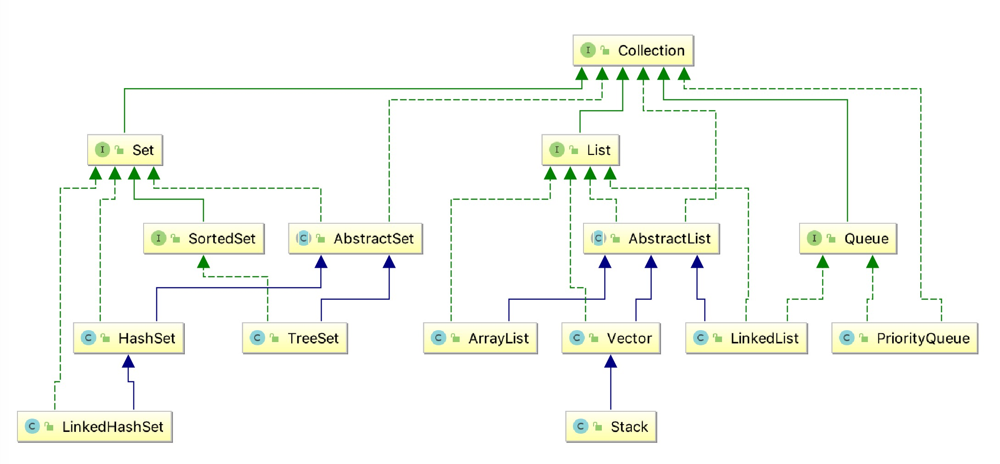
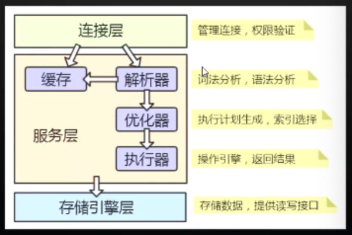
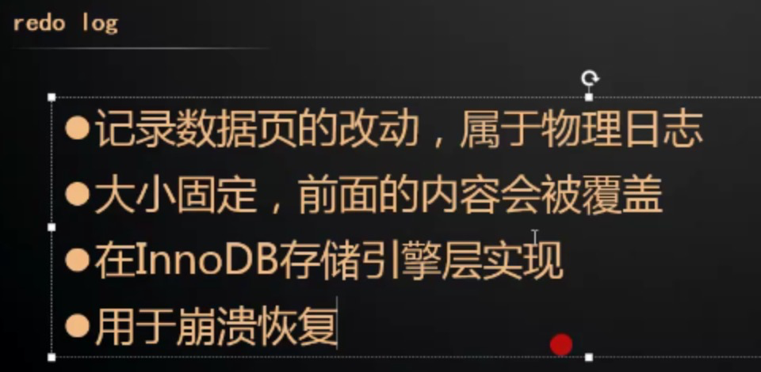

# 简介

使用[Typora](http://typora.io)查看文档结构更清晰

# 资料库

[Java在线API](http://www.matools.com/api/java8)

# Java关键技术总结

## Java执行过程


## 面向对象

### 继承

### 封装

### 多态

## 基础

### 基本类型和值类型

### 装箱和拆箱

### 内存模型

### 集合

### Collections



### Map


#### 框架图


### 重点集合

#### Map

- <key,value>的键值对（Entry）形式
- key值不能重复

##### HashMap

- 线程不安全
- key值可为null，单只能有一个Key为null，value不可为null
- 源码：
  - hash碰撞
  - 扩容：默认长度16，可初始化设置，水位达到0.75即3/4进行扩容，如初始化设置值应为数据个数n的 n/0.75+1
  - Put：
  - Get：

##### HashTable

##### LinkedHashMap

##### TreeMap


#### Collection下集合

##### 结构


##### List（有序、可重复）

​	元素排列有序，可重复

###### ArrayList

- **优点:** 底层数据结构是数组，查询快，增删慢。
- **缺点:** 线程不安全，效率高
- 常用命令：

###### Vector

- **优点:** 底层数据结构是数组，查询快，增删慢。
- **缺点:** 线程安全，效率低

###### LinkedList

- **优点:** 底层数据结构是链表，查询慢，增删快。
- **缺点:** 线程不安全，效率高

##### Set（无序，唯一）

###### HashSet

- 底层数据结构是哈希表
- hashCode()和equals()保证唯一

###### LinkedHashSet

- 底层数据结构是链表和哈希表。(FIFO插入有序,唯一)
- 由链表保证元素有序
- 由哈希表保证元素唯一

###### TreeSet

- 底层数据结构是红黑树。(唯一，有序)
- 如何保证元素排序的呢?自然排序、比较器排序
- 如何保证元素唯一性的呢?根据比较的返回值是否是0来决定

##### Queue（有序，可重复）

### 泛型

https://segmentfault.com/a/1190000014824002?utm_source=tag-newest

#### 自定义泛型

泛型字母可随意指定，尽量使用单个大写字母（如多个可以T1，T2）

- T    Type
- K  V   Key  Value
- E    Element
- ?    未知类型，类型参数赋予不确定性，任意类型
- 可随意指定

#### 泛型类

- 只能用在成员变量上，只能使用引用类型
- 泛型不能使用在static静态属性上

#### 泛型接口

- 只能用在抽象方法上
- 接口中泛型字母只能使用在方法上，不能使用在全局常量中

#### 泛型方法

- 返回值前面加上泛型
- 上限（extends）泛型的上限
  - <= 一般用于限制操作，不能使用在添加数据上，一般都是用于数据的读取
  - ? extends List
- 下限(super) 泛型的下限
  - 父类或本身，一般用于下限操作
  - ？ Super List
- T... 即 T[] 可变参数，即可不传递

#### 泛型嵌套

例如HashMap<>

#### 其他

- 泛型没有数组
- 泛型没有多态

### 反射

## 面试题

#### StringBuilder和StringBuffer区别？

## Java8新特性

### Lamda

### 红黑树

[^ps]: 查看数据结构下红黑树介绍


### ...

## 并发编程

### [链接地址](https://gitee.com/code2money/daydayup/tree/master/daydayup-high-concurrency)


# JVM

## 相关资料

[一张图看懂JVM](https://mp.weixin.qq.com/s?__biz=MzAxNjk4ODE4OQ==&mid=2247484432&idx=1&sn=381c98c49ffb813a9b9799e232a5a42c&chksm=9bed2562ac9aac74f6a3c5cc8f8c4a145e5bd9489eadd7ef12bc687239fa5ead497dac00ce6e&scene=0&key=c0940e0b2170699ab63621476b009383645cc10db9ce1ce7685af04b9b20dd771e838e4e1ffaa9ddb1c59193c5d686ba714c73cfd56311f55b001a680eacd79efd173308acf3eae64c7326dc30b06cd9&ascene=1&uin=MjgwMTEwNDQxNg%3D%3D&devicetype=Windows-QQBrowser&version=6103000b&lang=zh_CN&pass_ticket=7VimjYLmQAgyidy1vuYk8UcovgLF%2Fov0yGxcp%2B%2FloNe8nO%2B2veg9hLIgh4PfuU6V)

## 简单介绍

JVM是Java Virtual Machine（Java虚拟机）的缩写，是一种虚构出来的规范

1. 和java没有直接关系
2. 只运行class文件
3. 两种运行模式client和server模式
   1. client模式 运行GUI Java桌面程序

## JVM架构图


## 基础知识

### 程序三种执行方式

#### 静态编译执行

​	编译成机器码，直接可以被CPU执行的命令

#### 动态编译执行

​	JIT编译是其中一种，运行时执行，可以将热点代码进行动态即时编译，编译之后的内容，放入方法区

​	动态编译通常指的是运行时将所有的代码都编译，JIT编译只是将部分代码进行编译（热点代码）

#### 动态解释执行

​	JMV有解析器，作用就是按照字节码指令进行逐行解析，逐行执行，每一次执行方法，都需要进行解析执行

### 即时、编译编译器

### JIT编辑器

程序中的代码只有热点代码时，才会编译为本地代码

#### 热点代码

运行过程中会被即时编译器编译的“热点代码”有两类：

1. 被多次调用的方法
2. 被多次执行的循环体

以方法为单位，Client模式1500次，Server模式10000次才会被定义为热点代码

#### 如果识别热点代码

1. 基于采样的热点探测
2. 基于计数器的热点探测

#### JIT编译器优化


## 常用命令


## 调优


# 常用框架

见其他文档


# 性能优化

## CPU使用100%排查

## OOM排查


# 数据结构

## 数组

## 链表

## 哈希

## 二叉树

## Btree

## Btree+

### 红黑树

### ...

# 设计模式

## 23种设计模式

[23种设计模式](https://gitee.com/code2money/daydayup/tree/master/daydayup-design-patterns)

## 代理模式


# 算法

[常用算法](https://gitee.com/code2money/daydayup/tree/master/daydayup-algorithm)

# 中间件

## Nginx

### 代理服务器

#### 正向代理服务器

- 对客户端的代理
- 架设在客户端的主机
- 客户端在使用代理服务器时是知道所要真正访问服务器的地址
- 作用：隐藏、翻墙、提速、缓存、授权

- 场景：

  翻墙使用的就是使用正向代理实现

  公司内部nexsus本地仓库就是代理服务器

#### 反向代理服务器

- 对服务端的代理
- 客户端在使用代理服务器**好像**是知道其所要访问的服务真正地址，但实际不知道
- 架设在服务端的逐级
- 作用：分布式路由、集群负载均衡、动静分离、缓存

### Nginx特点

- 高并发
  - 默认情况下可达到1000的并发量
  - 硬件允许情况下5-10w并发
- 低消耗
  - 10000个非活跃连接，Nginxg中仅消耗2.5M的内存
- 热部署
  - 修改配置后可平滑重启
  - 可提供7*24小时不间断服务
- 高可用
  - Nginx中有一个主进程，有多个worker进程
- 高扩展
  - C语言扩展模块，与LUA脚本扩展模块 http://openresty.org/cn/

信息安全三要素：保密性、完整性与可用性

#### 安装

安装

```
安装C环境(c语言编写)：yum -y install gcc gcc-c++
安装依赖库：yum -y install pcre-devel openssl-devel
下载下载：wget http://nginx.org/download/nginx-1.16.1.tar.gz
创建文件路径：mkdir /opt/apps
解压到指定路径：tar -zxvf nginx-1.16.1.tar.gz -C /opt/apps/
查看查看可携带参数：./configure --help
生成makefile：./configure --prefix=/usr/local/nginx --with-http_ssl_module
编译编译后直接安装：make && make install
转到目录：cd /usr/local/nginx （核心配置文件conf/nginx.conf）
创建创建软链接：cd ~ 
   ln -s /usr/local/nginx/sbin/nginx /usr/local/sbin/

查看进程ps aux | grep nginx
```

相关命令

````
nginx
-t	检查配置文件是否有错误
-q  -tq一般组合使用，如果配置文件有错误会提示
-s （最常用）	stop 强制停止 quit 优雅停止，不会影响正在进行的任务 reopen 打开日志文件 reload 热部署平滑重启
-p  设置配置文件路径
-c  指定配置文件
-g	全局指令，一般不用
````

#### 零拷贝

##### 零拷贝基础

零拷贝指的是从一个存储区域到另一个存储区域的copy任务没有CPU内核(ALU)参与。通常用于网路文件传输，以减少CPU消耗和内存带宽占用，减少用户空间（用户可操作的内存缓存区域）与CPU内核空间（CPU可操作的内存缓存区域及寄存器缓存）的拷贝过程，减少用户上下文（用户状态环境）与CPU内核上下文（CPU状态环境） 间的切换，提高系统效率。

DMA直接内存访问

##### 传统拷贝方式


#### 多路复用

## 消息中间件

### 多种消息中间件对比

### RocketMQ

#### 主从

#### 组成部分

- 消息服务器（Broker）
- 生产者（Product）
- 消费者（Consumer）
- 主题（Topic）
- 组费者组（Group）
- 队列（Queue）
- 消息体（Message）

#### 重试机制

#### 重置消费位

------


### Kafka


------


### RibbitMQ

## 缓存

### Redis

​	单线程的内存操作

#### 类型

#### 常用命令

#### 数据底层存储结构

#### 模式

- 集群模式
- 主从模式

#### 实现分布式锁

#### Lua


### 本地缓存

## Zookeeper

### 选举策略

### 临时节点

### 实现分布式锁

## ELK

### LogStash

### ElacticSearch

### Kiabana


## 分库分表


# 数据库

## MySQL

MySQL5.7 帮助文档 https://dev.mysql.com/doc/refman/5.7/en/storage-engines.html




### 连接方式

```
查看最大连接数：Show variables like 'max_connections'
最后一条语句的开销：show stats  last_query_cost
innodb_page_size
查看是否开启：show variables like log_bin%

optimizer_trace
```

### 通信协议

#### TCP/IP


#### Unix Socket

### 通信方式

```
查看最大传输大小： max_
```


单工

单双工

全双工


### 解析器(Parser)

#### 词法解析

#### 语法解析

结果：


### 存储引擎

innodb：https://dev.mysql.com/doc/refman/5.7/en/innodb-architecture.html


### Redo.log，崩溃时恢复使用



### Undo log

事务回滚

### Bin log

记录所有DLL

待记录。。。

### 存储模式/结构

### 字段类型

### SQL执行顺序

### JDBC隔离机制

### 模式

####  主从模式

#### 哨兵模式

### 索引

#### 存储结构

#### 索引类型

### SQL慢查优化


## NoSQL

### MongonDB

### ElacticSearch


# 分布式相关

## 分布式唯一ID

## 分布式锁

### 什么是乐观锁?

### 什么是悲观锁?

### MySQL锁

### Redis实现锁

### Zookeeper实现锁

### 不同锁对比

## 分布式事务的数据一致性

### 数据一致性问题

- 数据的并发访问、修改
- 不同请求之间的数据隔离
- 多个服务共同完成一个业务请求，保证完成或失败
- 发生异常时的数据回滚

### 两阶段提交

### 三阶段提交

### TCC

### 补偿机制

### 分布式事务解决方案

> - 分布式事务 ->长事务
> - 本地事务->短事务
> - 一个长事务转换成多个短事务
> - 失败后补偿处理

### 场景举例

业务场景一：用户对商品下单

> - 减商品库存
>
> - 减用户红包
>
> - 创建订单


## 分布式调度

## 分布式缓存


# 微服务

## Spring Cloud

## Dubbo

# 运维

https://gitee.com/vipspecial/java-knowledge/blob/feature_1/%E8%BF%90%E7%BB%B4.md


# 架构相关

# 什么是架构

## 架构相关设计能力

1. ###### 抽象思维：通过现象看透本质

2. ###### 动态组合思维：静态知识转换动态思维

   1. 比如Spring boot、mq怎么用
   2. 怎么用都属于静态资源

3. ###### 掌握架构哲学本质：以不变应万变

   1. 第一性原理
   2. 降本增效

4. ###### 塑造个人影响力：IP、品牌


## 架构相关技术设计

1. 高并发分布式事务的数据一致性设计
2. 重试技术设计
3. 请求幂等技术设计
4. 负载均衡设计
5. 隔离技术设计
6. 熔断设计
7. 限流设计

# 应用架构

## 单体架构

## 服务架构（SOA）

## 微服务

# 系统架构

## 网关

## 缓存

## 等

# 专业术语之源码阅读能力

## 英语单词

