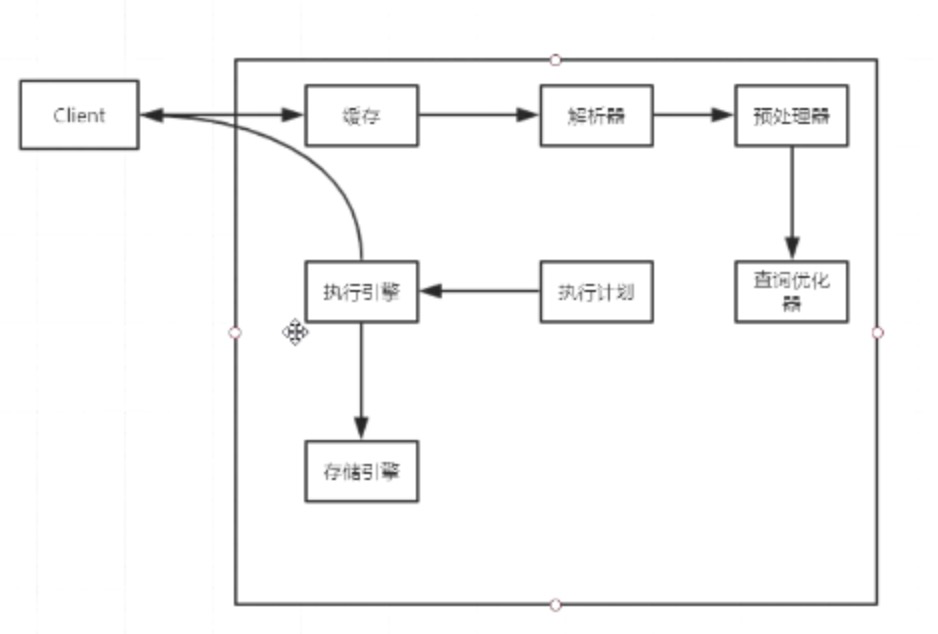
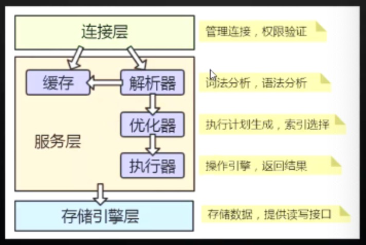
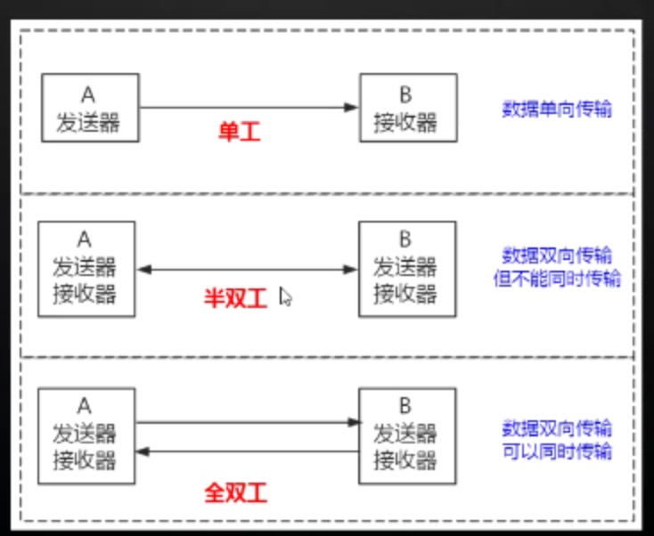
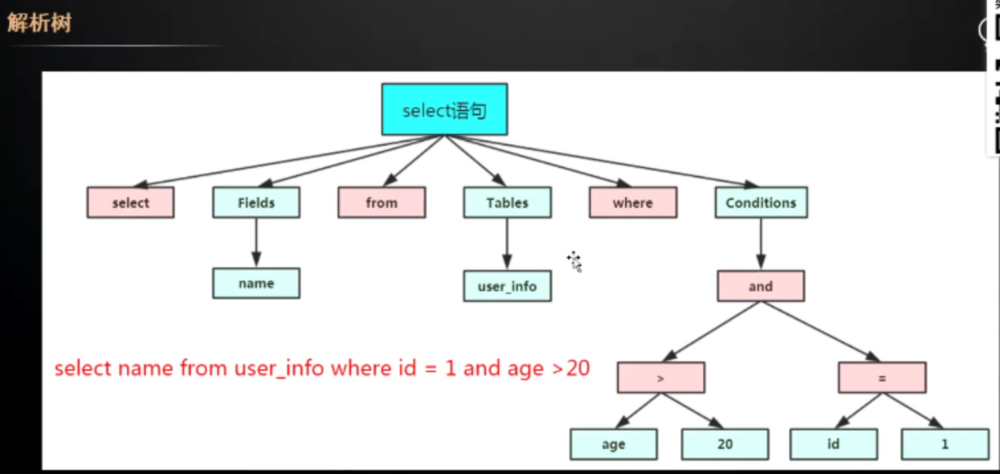
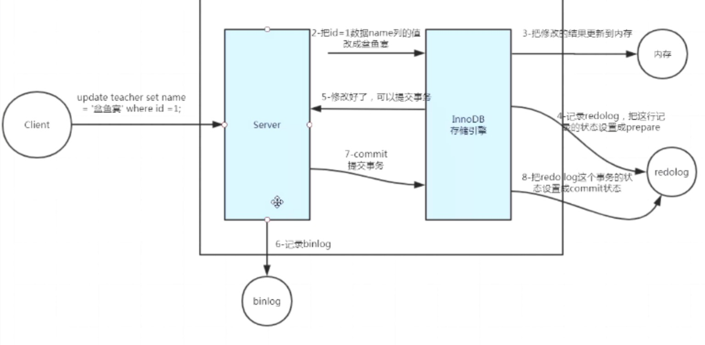

# 数据库

## MySQL

MySQL5.7 帮助文档 https://dev.mysql.com/doc/refman/5.7/en/storage-engines.html






### 连接方式

```
查看最大连接数：Show variables like 'max_connections'
最后一条语句的开销：show stats  last_query_cost
innodb_page_size
查看是否开启：show variables like log_bin%

optimizer_trace
```

### 通信协议

#### TCP/IP


#### Unix Socket

### 通信方式

```
查看最大传输大小： max_
```


单工

单双工

全双工





### 解析器(Parser)

#### 词法解析

#### 语法解析

结果：



### 存储引擎

innodb：https://dev.mysql.com/doc/refman/5.7/en/innodb-architecture.html




### Redo.log，崩溃时恢复使用


### Undo log

事务回滚

### Bin log

记录所有DLL

待记录。。。

### 存储模式/结构

### 字段类型

### SQL执行顺序

### JDBC隔离机制

### 模式

####  主从模式

#### 哨兵模式

### 索引

#### 存储结构

#### 索引类型

### SQL慢查优化

## 分库分表

## NoSQL

### MongonDB

### ElacticSearch

