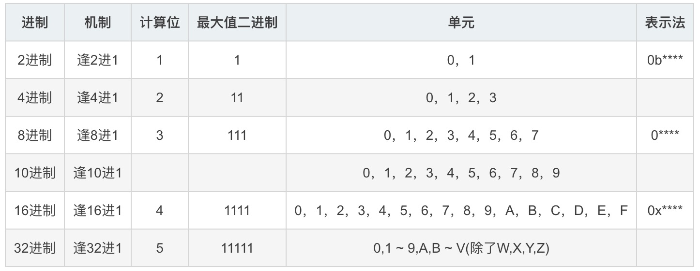

# 进制转换

N进制，逢N进1

## 原理

## 进制换算

- 十进制

  n转换为十进制

  abc(n) = a * n^2 + b * n^2 + c * n^2

- n转换为2进制

  10进制转换为N进制，那就要“除N取余”了

  如 123转换为2进制：
  		123/2=61..........1
  		61/2=30...........1
  		30/2=15............0
  		15/2=7.............1
  		7/2=3................1
  		3/2=1...............1
  		1/2=0...............1
  		所以 123(10进制)=1111011(2进制)

## 参考

[参考各进制之间转换](https://jingyan.baidu.com/article/495ba84109665338b30ede98.html)

[进制转换原理](https://blog.csdn.net/loongshawn/article/details/81269761)

# 位移

